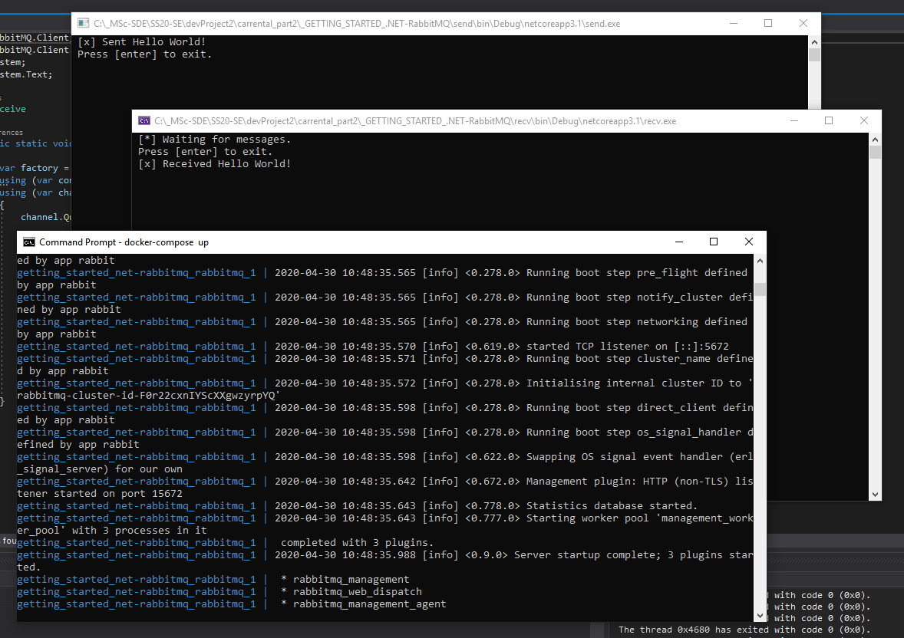

# GETTING STARTED .NET/RabbitMQ

## Step one

Install RabittMQ Server (see [link](https://www.rabbitmq.com/install-windows.html))

## Step two

Add NuGet package "RabbitMQ.Client" to the "recv" and "send" -projects if not already included.

## Step three

Start message broker:
- with docker you can use the docker-copose.yml in this directory (cmd: "docker-compose up")
- without docker you can simple use the rabbitMQ START shortcut in the Windows start menu (created autmaticaly with installation; the service is possible already running)

## Step four

Start the receiver by right-clicking the "recv" project then -> debug/start new instance

## Step five

Start the sender by right-clicking the "send" project then -> debug/start new instance

## Result

